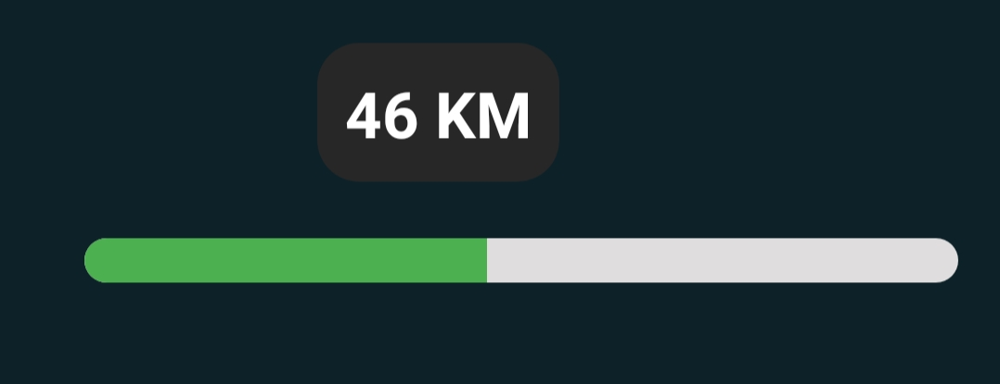
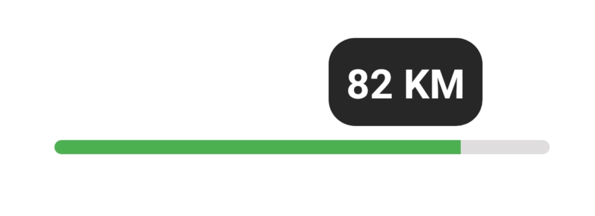

## indicator SeekBar version 


 


###### in project --> build.gradle

```gradle
allprojects {
    repositories {
        google()
        jcenter()
        maven { url 'https://jitpack.io' }

    }
```
###### in app --> build.gradle file :

```gradle

android {
...
  compileOptions {
        sourceCompatibility JavaVersion.VERSION_1_8
        targetCompatibility JavaVersion.VERSION_1_8
    }
...
}

dependencies {

implementation 'com.github.EsmaeelNabil:EsViewsFactory:0.2.1'

}
```

Kotlin Example
--------------

```java
override fun onCreate(savedInstanceState: Bundle?) {
        super.onCreate(savedInstanceState)
        setContentView(R.layout.activity_main)

        //default prefix is => "KM"
        seekBar.doTheMagicIn(this)
        
        //Custom prefix
        seekBar.doTheMagicIn(this,indicatorPrefix = "USD")


        // if you want to design your indicator
        // make a layout file inside it a TextView it's id ==> progress_text
        seekBar.doTheMagicIn(this,indicatorLayout = R.layout.indicator_layout)

        // Full Custimized indicator 
        seekBar.doTheMagicIn(this,indicatorLayout = R.layout.indicator_layout,indicatorPrefix = "USD")

    }
```
