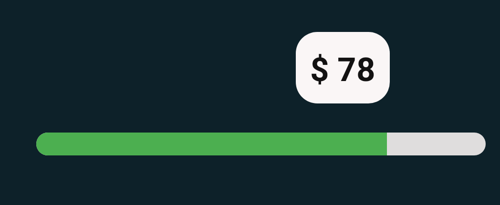
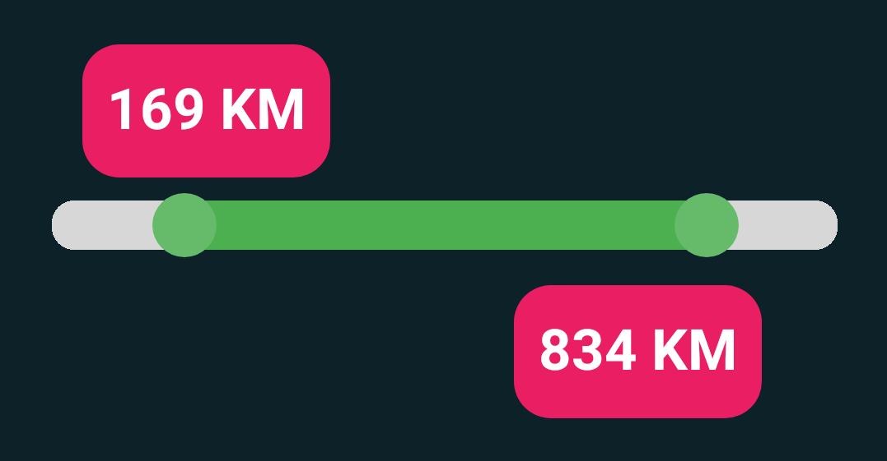

## indicator SeekBar version 


##### this library contains two custom views.

```gradle
 EsSeekBar
 EsRangeBar
```


###### in project --> build.gradle

```gradle
allprojects {
    repositories {
        google()
        jcenter()
        maven { url 'https://jitpack.io' }

    }
```
###### in app --> build.gradle file :

```gradle

android {
...
  compileOptions {
        sourceCompatibility JavaVersion.VERSION_1_8
        targetCompatibility JavaVersion.VERSION_1_8
    }
...
}

dependencies {

implementation 'com.github.EsmaeelNabil:EsViewsFactory:0.2.2'

}
```

XML Example
--------------



```xml

<com.esmaeel.indicatorseekbar.EsSeekBar
			android:id="@+id/_seekbar"
			android:layout_width="match_parent"
			android:layout_height="wrap_content"/>

```




```xml

<com.esmaeel.rangeindicatorseekbar.EsRangeBar
			android:id="@+id/_rangebar"
			android:layout_width="match_parent"
			android:layout_height="wrap_content"/>

```

Kotlin Example
--------------

```java
override fun onCreate(savedInstanceState: Bundle?) {
        super.onCreate(savedInstanceState)
        setContentView(R.layout.activity_main)

        //Simple EsSeekBar
        _seekbar.doTheMagicIn(this,::seekBarListener)
        
        // Custom EsSeekBar with default indicator background "BLACK"
        _seekbar.doTheMagicIn(this,::seekBarListener
            ,indicatorPrefix = "KM"
            ,prefixPositionStart = false)
        
        // Custom EsSeekBar
        _seekbar.doTheMagicIn(this,::seekBarListener
            ,indicatorBackground = EsSeekBar.WHITE
            ,indicatorPrefix = "$"
            ,prefixPositionStart = true)
           
	 // Custom EsSeekBar
        _seekbar.doTheMagicIn(this,::rangeBarListener
            ,indicatorBackground = EsSeekBar.CUSTOM_LAYOUT
            ,indicatorLayoutResource = R.layout.indicator_black
            ,indicatorPrefix = "KM"
            ,prefixPositionStart = false)
            
        // rangeBar with indicator default white background
        _rangebar.doTheMagicIn(this,::rangeBarListener
            ,indicatorBackground = EsSeekBar.WHITE
            ,indicatorPrefix = "KM"
            ,prefixPositionStart = false)
	    
	 // Custom rangeBar with indicator custom layout 
        _rangebar.doTheMagicIn(this,::rangeBarListener
            ,indicatorBackground = EsSeekBar.CUSTOM_LAYOUT
            ,indicatorLayoutResource = R.layout.indicator_black
            ,indicatorPrefix = "KM"
            ,prefixPositionStart = false)

    }
```
